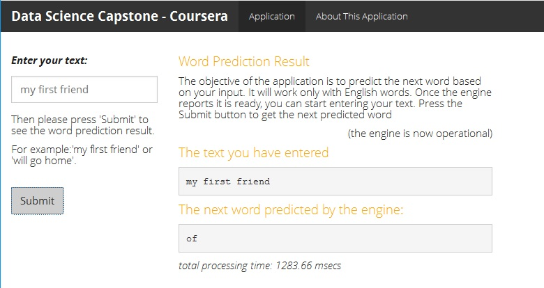

Data Science Capstone Project
========================================================

*[Natural Language Processing](https://en.wikipedia.org/wiki/Natural_language_processing)*

This presentation summarizes the challenge, solution and results for the capstone project: build a model and application for predicting the next word when a user types a sentence. The capstone project concludes the [Data Science Specialization](https://www.coursera.org/specializations/jhu-data-science) from [Coursera](https://www.coursera.org/) and is offered in partnership with [SwiftKey](http://www.swiftkey.com).

*Erwin Vorwerk*   
*March 2017*
 

Challenge
========================================================

- The main objective of this capstone project is to build a predictive application that is able to predict the next word, like is being used by [SwiftKey](http://www.swiftkey.com).

- A large set of [text data](https://d396qusza40orc.cloudfront.net/dsscapstone/dataset/Coursera-SwiftKey.zip) is available to train and validate the model. It contains hundreds of megabytes of blog, news and twitter data in various languages. 

- The R environment (including the wide array of packages available to it) has to be used to load, analyze and cleanse data. And to build the predictive model and a [Shiny](https://www.shinyapps.io/) interface to provide interaction between user and model.

- Background resources are provided to start understanding Natural Language Processing and to support with resolving this challenge:

    - [Text mining infrastructure in R](http://www.jstatsoft.org/v25/i05/)
    - [CRAN Task View: Natural Language Processing](http://cran.r-project.org/web/views/NaturalLanguageProcessing.html)
    - [Stanford Natural Language Processing MOOC](https://www.coursera.org/learn/nlp)

Solution
========================================================

  
__Preparation__:

- Source data (twitter, news, blogs) is downloaded, read, examined, sampled and cleansed.
- Unigrams, bigrams and trigrams (lists of co-occuring words in the text) are being created and stored to serve as input for the prediction model.

__Application__:

- The Shiny application contains two components: _user interface_ (where the layout and functionality are being defined) and _server_ (where the processing of user interactions takes place)
- The user can start entering a text, and the text is being sent (after cleansing) to the prediction model in real time
- The prediction engine uses the Katz Backoff algorithm to predict the next word based on the text the user has entered, the predicted word is presented back to the user.
  
  

- In addition to the data entry and prediction functionality, the application should also provide support for the user to understand the application and underlying functionality.

Result
========================================================

A running instance of the _Next Word Prediction_ application - built using R and Shiny - can be found on my [ShinyApps](https://krewrov.shinyapps.io/capstone) location. It also contains an explanation on how it works and how to use it.

Additional Information
========================================================

__Work__:

- All work (milestone report, presentation, code, data files, etc) created for this assignment can be found in my [GitHub](https://github.com/krewrov/capstone) repo.

- This presentation has been uploaded onto my [RPubs](https://rpubs.com/krewrov/capstone) location

__Natural Language Processing__:

- The [Katz's back-off model] (https://en.wikipedia.org/wiki/Katz's_back-off_model) has been used to estimate the conditional probability of a word and help predict the next word.

- The package [ANLP](https://cran.rstudio.com/web/packages/ANLP/) (Build Text Prediction Model) contains very rich functions to help sample and clean text data, build N-gram models and use the Backoff algorithm. Its functions are extensively used in my solution.

- Interesting paper on [Natural Language Processing](http://www.modsimworld.org/papers/2015/Natural_Language_Processing.pdf), which outlines a fully reproducable approach and model to predict a sequence of words. 

